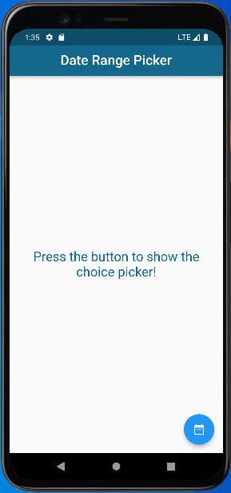

How to pick a date range in Flutter using the Date Range Picker .

# The following adds the Cupertino Icons font to your application.
# Use with the CupertinoIcons class for iOS style icons.
  cupertino_icons: ^1.0.2
  intl: ^0.17.0

### ✌&ensp;Preview

A new Flutter project.

|              App Preview             
| :----------------------------------: 
|  

### 📺&ensp;Watch Video

##### [YouTube video](https://youtu.be/RbTyC0ipCCI "Youtube Decor Zone") where the *source code* is explained. [Subscribe YouTube channel.](https://www.youtube.com/c/DecorZone?sub_confirmation=1 "YouTube Subscribe Decor Zone")  

➜&ensp;[Watch My Video](https://youtu.be/RbTyC0ipCCI "Watch My Video")
